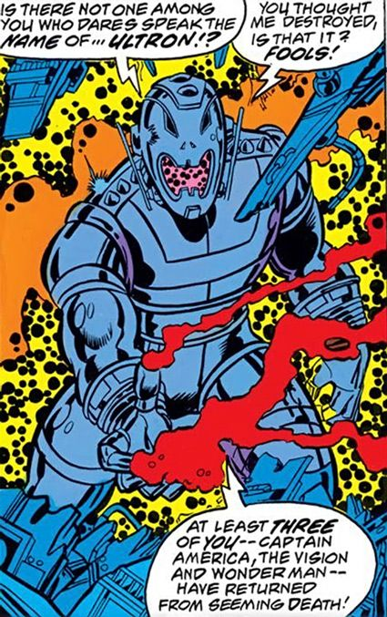

.. image:: https://readthedocs.org/projects/ultron8/badge/?version=latest
    :target: https://ultron8.readthedocs.io/?badge=latest
    :alt: Documentation Status

.. image:: https://travis-ci.org/bossjones/ultron8.svg?branch=master
    :target: https://travis-ci.org/bossjones/ultron8?branch=master

.. image:: https://codecov.io/gh/bossjones/ultron8/branch/master/graph/badge.svg
  :target: https://codecov.io/gh/bossjones/ultron8

.. image:: https://coveralls.io/repos/github/bossjones/ultron8/badge.svg?branch=master
  :target: https://coveralls.io/github/bossjones/ultron8?branch=master

.. image:: https://img.shields.io/pypi/v/ultron8.svg
    :target: https://pypi.python.org/pypi/ultron8

.. image:: https://img.shields.io/pypi/l/ultron8.svg
    :target: https://pypi.python.org/pypi/ultron8

.. image:: https://img.shields.io/pypi/pyversions/ultron8.svg
    :target: https://pypi.python.org/pypi/ultron8

.. image:: https://img.shields.io/badge/STAR_Me_on_GitHub!--None.svg?style=social
    :target: https://github.com/bossjones/ultron8

------

.. image:: https://img.shields.io/badge/Link-Document-blue.svg
      :target: https://ultron8.readthedocs.io/index.html

.. image:: https://img.shields.io/badge/Link-API-blue.svg
      :target: https://ultron8.readthedocs.io/py-modindex.html

.. image:: https://img.shields.io/badge/Link-Source_Code-blue.svg
      :target: https://ultron8.readthedocs.io/py-modindex.html

.. image:: https://img.shields.io/badge/Link-Install-blue.svg
      :target: `install`_

.. image:: https://img.shields.io/badge/Link-GitHub-blue.svg
      :target: https://github.com/bossjones/ultron8

.. image:: https://img.shields.io/badge/Link-Submit_Issue-blue.svg
      :target: https://github.com/bossjones/ultron8/issues

.. image:: https://img.shields.io/badge/Link-Request_Feature-blue.svg
      :target: https://github.com/bossjones/ultron8/issues

.. image:: https://img.shields.io/badge/Link-Download-blue.svg
      :target: https://pypi.org/pypi/ultron8#files

Why ``ULTRON-8``?
==============================================================================

Welcome to ``ultron8`` Documentation
==============================================================================

Documentation for ``ultron8``.

.. _install:

Install
------------------------------------------------------------------------------

``ultron8`` is released on PyPI, so all you need is:

.. code-block:: console

    $ pip install ultron8

To upgrade to latest version:

.. code-block:: console

    $ pip install --upgrade ultron8

.. code-block:: console
      export PYENV_ROOT="$HOME/.pyenv"
      export PATH="$PYENV_ROOT/shims:$PYENV_ROOT/bin:$PATH"
      eval "$(pyenv init -)"
      eval "$(pyenv virtualenv-init -)"

.. _testing:

Local Testing
------------------------------------------------------------------------------

``ultron8`` can be tested locally if you have all of the correct dependencies installed, simply run:

.. code-block:: console

    $ pipenv run pip install -e .

To run local tests, first start up the web server:

.. code-block:: console

    $ make serve-daemon

Then run pytest using our wrapper script:

.. code-block:: console

    $ make ci-local

Resources
------------------------------------------------------------------------------

https://www.reddit.com/r/PhotoshopRequest/comments/a7fzua/specific_photoshop_this_picture_of_ultron/
